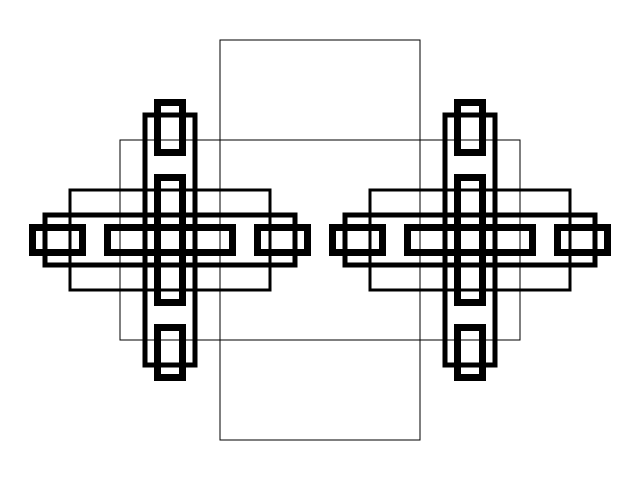
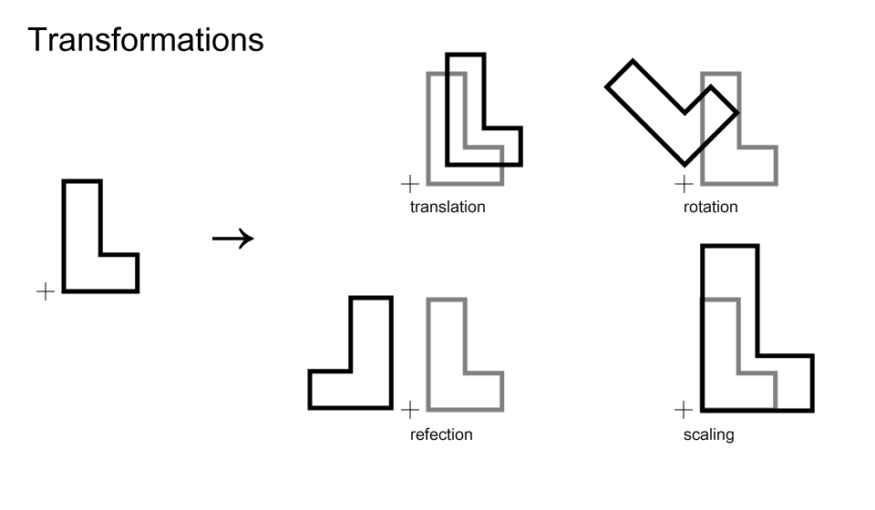
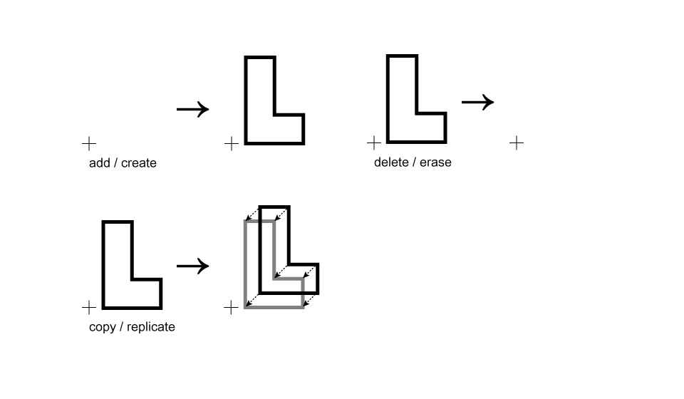

# Class 4 : Formal Systems & Shape Grammars

## Schedule

1. Hello, Class!
2. Markdown, redux
3. Student Introductions
4. Intro to Shape Grammars
5. Assignment 2

##Notes

### Formal Systems

* The MU system from [Godel, Escher, Bach](Content/TheMU-Puzzle.pdf)

### The Ambiguity of Shape

What do you see?  

### An Algebra for *Shape*

* [Transformations](http://www.coedu.usf.edu/main/departments/sped/PROPEL/documents/MicrosoftWord-Transformations.pdf)

Add, Delete, Copy

### Spacial Relationships

* ~~World Coordinate System~~  
* Chairs

### Shape Grammars

> "Shape grammars perform computations with shapes..."  

> *From [shapegrammar.org](http://www.shapegrammar.org/intro.html)*

* [shapegrammar.org](http://www.shapegrammar.org/)

* Formalization
    * &#8594; (the single arrow) == a rule
    * &#8649; (the double arrow) == a computation... step-by-step
    * Rules vs. Computations
        * Initial Shapes
* Simple Rules:
    * Transformation  
    
      
    * Addition
      
      

## Assignment

> Due: Next Class (14:30 IST - 25 August, 2014)

1. [Worksheet](Content/newMedia_worksheet0.pdf) (print out and turn in)
2. Readings from last week.
