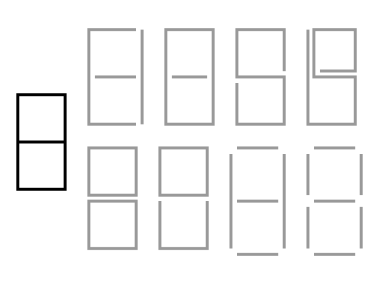
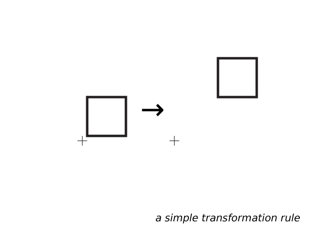
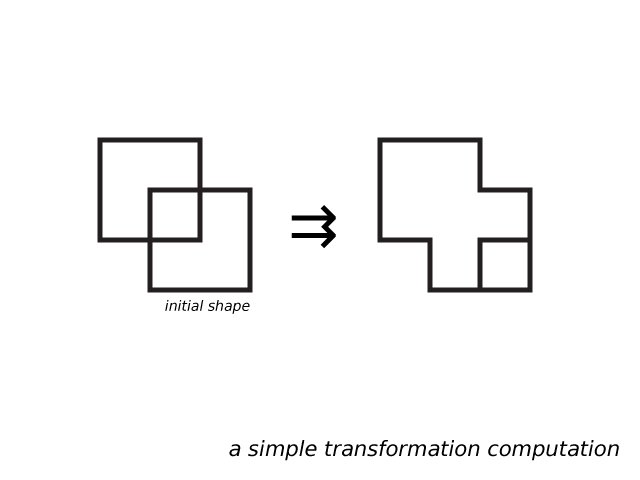
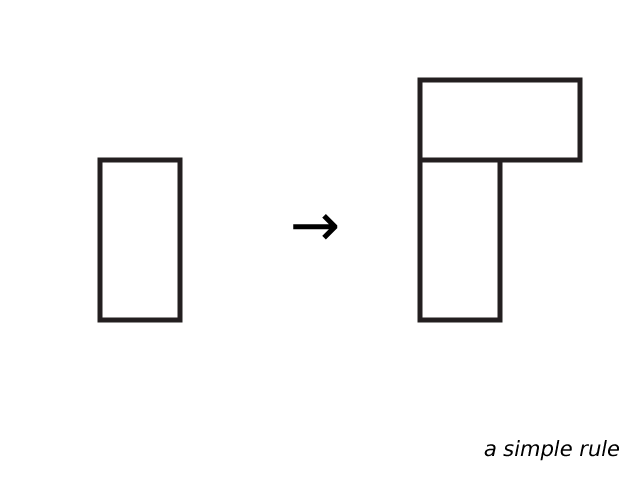
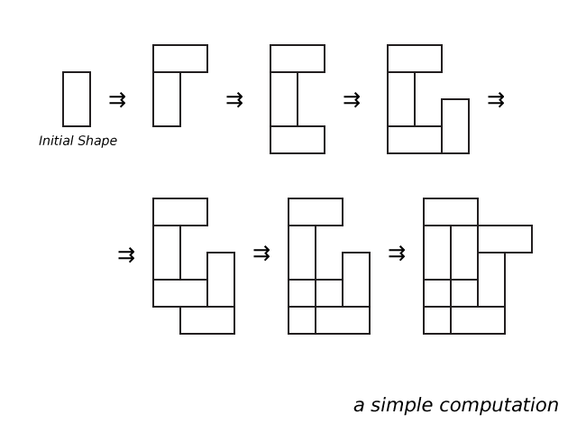

# Class 4 : Formal Systems & Shape Grammars

## Schedule

1. Hello, Class!
2. Markdown, redux
3. Student Introductions
4. Intro to Shape Grammars
5. Assignment 2

##Notes

### Markdown

* [stackedit.io](http://stackedit.io)  
* [stackedit.io beta (it's new!)](https://stackedit-beta.herokuapp.com/#)

---

### Shape Grammars

> "Shape grammars perform computations with shapes..."  

> *From [shapegrammars.org](http://www.shapegrammar.org/intro.html)*

* [shapegrammar.org](http://www.shapegrammar.org/)
* The Ambiguity of Shape
    
* Formalization
    * &#8594; (the single arrow) == a rule
    * &#8649; (the double arrow) == a computation... step-by-step
    * Rules vs. Computations
        * Initial Shapes
* Simple Rules:
    * Transformation  
    
      
    * Addition
      
      

## Assignment

> Due: 14:30 IST - 19 August, 2014

1. Author five (5) rules
2. For each Rule: Perform five (5) computations with **at least** 10-20 steps
3. Take one (1) *final shape* from one of the computations: create an *artistic interpritation* of the shape
