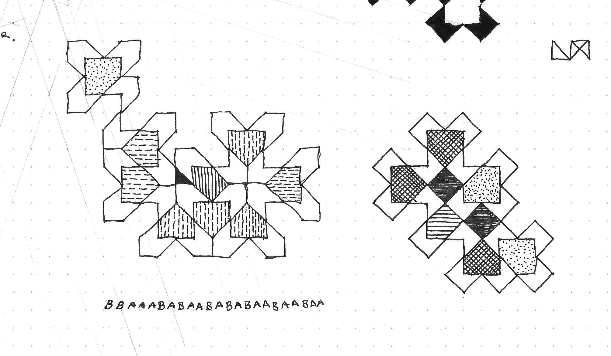

# Class 5 : MUIUIU

## Schedule

1. Hello
2. Questions on the Assignment (worksheet) ... turn in.
3. Discussion: Formal systems & Shape Grammars
4. Assignment

## Assignment

> Due: Next Class (14:30 IST - 1 September, 2014)

1. [*The Alphabet and the Algorithm* (Mario Carpo)](Content/alphabet.pdf)
